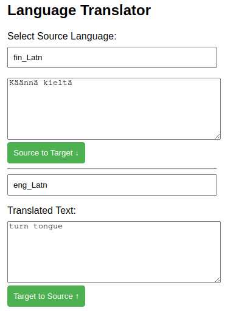

# TurnTongue

This is tongue in cheek (pun intended) example how to use facebook/meta NLLB languge translator model.



NLLB is not perfect translator but quite good for offline/confidental usage or when working with rare languages

# Installation

TBD

Install tensorflow libraries

# Starting server

Server starts by default on port 8000.

There are few options

```sh
options:
  -h, --help            show this help message and exit
  -p PORT, --port PORT  TCP port number
  -m MODEL, --model MODEL
                        Model name https://huggingface.co/facebook/nllb-200-1.3B, facebook/nllb-200-distilled-600M,facebook/nllb-200-3.3B etc..
  -n MAXLENGTH, --maxlength MAXLENGTH
                        max length
```


# API
API is very simple

Do HTTP **POST** to any endpoint on specific port where server is running

with parameters
- *source* name language on payload (default is finnish)
- *target* name of target language (default is english)

Payload is raw utf8 text.

For example when translating from finnish to english

```sh
curl -X POST -H "Content-Type: text/plain" -d "laiska koira hyppäsi ruskean ketun yli" http://localhost:8000
```
would produce
*The lazy dog jumped over the brown fox*

When translating other languages then *source* and *target* need to be defined
```sh
curl -X POST -H "Content-Type: text/plain" -d "The lazy dog jumped over the brown fox" "http://localhost:8000/?source=eng_Latn&target=est_Latn"
```

List of supported language names are found from html GUI

## Html GUI

html gui is simple single page app. just open web browser http://hostname:port